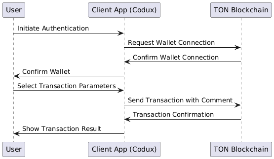
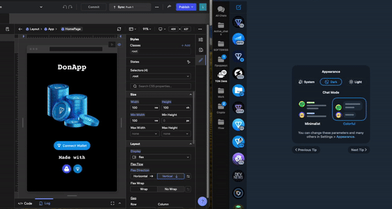
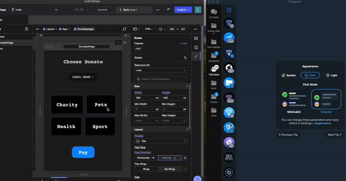

# PoC TonDapp with Codux

This project serves as a Proof of Concept (PoC) to evaluate the capabilities of the Codux development environment and its integration with the TON blockchain ecosystem. The primary goal is to assess how efficiently basic functionality for a decentralized application (dApp) can be implemented, including user authentication and transaction submission to the TON blockchain, while using Codux as the development platform.

The project demonstrates two key features:

Authentication — Secure user connection to the dApp.
Transaction Submission — Sending a blockchain transaction with additional information in the form of a comment.

    
## Auth with Ton wallet

Authentication is implemented using integration with TON, allowing users to sign in with their TON wallet. This functionality includes:

Connecting to the user's wallet through the TON interface.
Verifying the presence of the required wallet and TON account.
Securely storing the user's session token on the client side for further operations.
Upon successful authorization, the user gains access to the transaction interface, where they can interact with the system based on their authenticated status.
## Transaction sending

The primary purpose of this section is to demonstrate the submission of a transaction to the TON blockchain with support for additional parameters.

Key transaction features:
* Transaction Submission: The user can initiate a transaction by selecting parameters, such as the destination purpose.
* Adding a Comment: Before submitting the transaction, the user can select an option, for example, "health" (or another contextual parameter), which is then passed as a comment in the blockchain transaction. This enables the storage of additional information on the blockchain for future analysis.
## My contacts
- [Telegram](https://t.me/ikustow)
- [Linkedin](https://www.linkedin.com/in/ikustow/)
- [Email](mailto:ikustov.dev@gmail.com)
